# Multi-Container Runtime

## Team information

- Pranjal A S Prabhu 
- Sunil S 

## Project Summary

This project implements a lightweight Linux container runtime in C with a long-running supervisor and a kernel-space memory monitor. It supports multiple containers, process isolation, logging, and memory enforcement.

---

## Build and Run Instructions

# Install dependencies (IMPORTANT)
sudo apt update  
sudo apt install -y build-essential linux-headers-$(uname -r) 

# Build  
cd boilerplate 
make 

# Load kernel module  
sudo insmod monitor.ko 

# Verify device (IMPORTANT)
ls -l /dev/container_monitor 

# Start supervisor  
sudo ./engine supervisor ./rootfs-base 

# Create container rootfs  
cp -a ./rootfs-base ./rootfs-alpha 
cp -a ./rootfs-base ./rootfs-beta 

# Start containers  
sudo ./engine start alpha ./rootfs-alpha /bin/sh 
sudo ./engine start beta ./rootfs-beta /bin/sh 

# Check containers  
sudo ./engine ps 

# View logs  
sudo ./engine logs alpha 

# Stop container  
sudo ./engine stop alpha 

# Check kernel logs (IMPORTANT)
dmesg | tail 

# Unload module  
sudo rmmod monitor 

---

## Demo Execution

1. Start the supervisor process 
2. Create container root filesystems 
3. Launch multiple containers (alpha, beta) 
4. Check running containers using `engine ps` 
5. View logs using `engine logs alpha` 
6. Observe CPU usage using `top`
7. Monitor memory behavior using `dmesg | tail`
8. Stop containers using `engine stop` 
9. Verify no zombie processes using `ps aux | grep defunct` 

---

## Demo screenshots  

### 1. Supervisor Running  
Shows supervisor managing containers. 

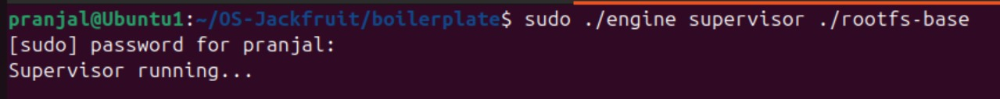 

---  

### 2. Multiple Containers Running  
Shows two containers created. 

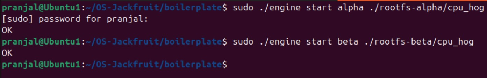 

---  

### 3. Container Metadata (ps)  
Shows container ID, PID and state. 

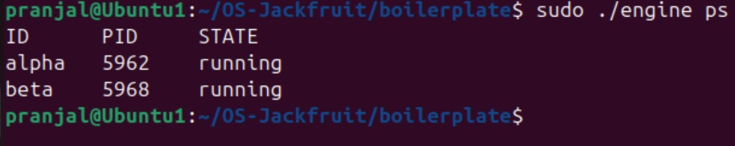 

---  

### 4. Logs Output  
Shows logging using IPC. 

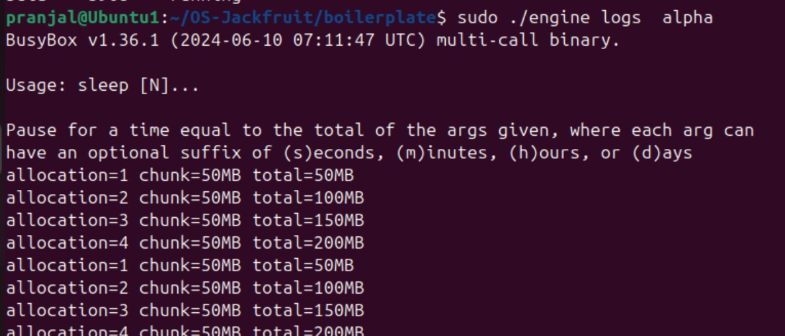 

---  

### 5. Stop Container  
Shows container stop and update. 

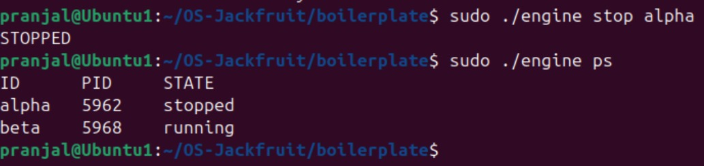 

---  

### 6. CPU Scheduling (top) 
Shows CPU usage and scheduling behavior. 

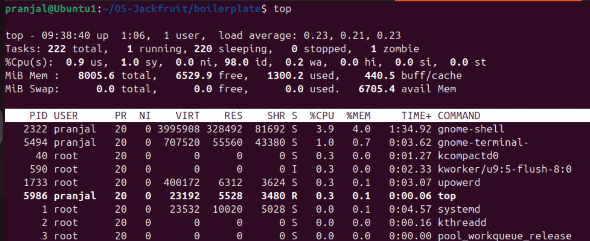 

---  

### 7. Memory Monitoring 
Shows soft/hard limit behavior. 
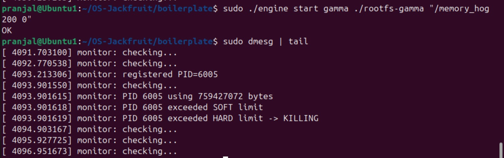 

---  

### 8. Build Output  
Shows successful compilation using make. 

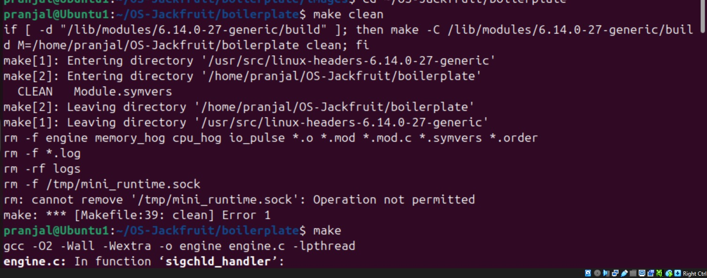 

---  

### 9. Kernel Module Loaded  
Shows device /dev/container_monitor. 

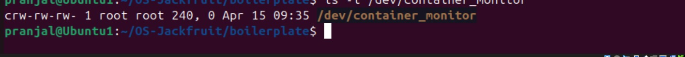 

---  

### 10. Root Filesystem  
Shows container rootfs structure. 

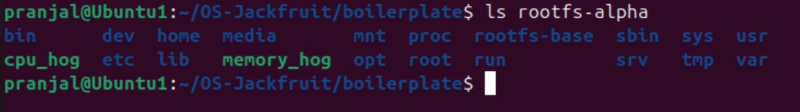 

---  

### 11. Containers File  
Shows stored container metadata. 

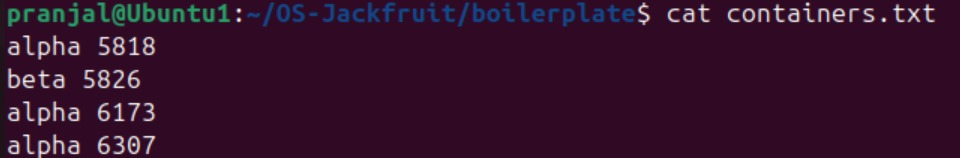 

---  

### 12. Cleanup (No Zombie Processes)  
Shows no defunct processes after execution. 

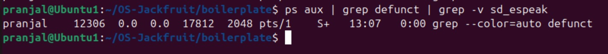 

---  

## Result  
- Multiple containers executed successfully
- Logs captured correctly 
- Kernel module working 
- No zombie processes observed 

---  

## Conclusion  
This project demonstrates how container runtimes work using Linux system programming concepts like process isolation, IPC, and kernel monitoring.
